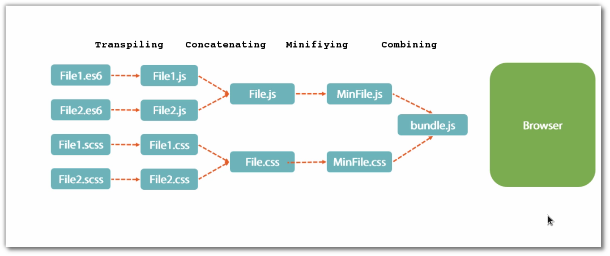

# webpack-notes
simple webpack notes.

## TOC

- [Need of webpack](#need-of-webpack)
- [Basics](#basics)

## Need of Webpack

Webpack is a build tool that puts all of your assets, including Javascript, images, fonts, and CSS, in a dependency graph. In short it is an optimized advanced task runner that is used to process input file into output files. It supports all the three module system i.e., CommonJS, AMD, ES6 modules.

The process involves below steps:

*Transpilation + Concatenation + Minification + Combine CSS into JS (Extra-feature that other task runners dont have)*



**Note:** Webpack use NPM not Bower.

## Basics

Let's suppose we have a Project structure like -
```
// Project Structure
webpack project
--> app.js
--> index.html  
```

### To build a file into output file -

`webpack <input_file_path> <output_file_path>`


It is very tedious task to pass parameters everytime in command line, so another way to do such task is to define a *config* file. The name of config file will be `webpack.config.js` which will export a CommonJS module encapsulating all our settings for webpack.

``` js
module.exports =  {
  entry: "<entry_file_path>",
  output: {
    filename: "<output_file_path>"
  }
};

```
Now we just have to write `webpack` in console to build output file. It is kind of convention to name output file as `bundle.js`.

After running `webpack` in CLI -

```
// Project Structure
webpack project
// this is input file
--> app.js
--> index.html  
--> bundle.js
```


### To rerun build whenever your input file is changed -

In command line, type `webpack --watch`

or

change your config file to

``` js
module.exports =  {
  entry: "<entry_file_path>",
  output: {
    filename: "<output_file_path>"
  },
  watch: true
};

```
This will automatically make a new build whenever your input file is changed.

### To start server -

Webpack has a dev server which can be installed by below command -

`npm install webpack-dev-server -g`

After install, you can run your webpack-dev-server by below command -

`webpack-dev-server`

Now point your browser to `localhost:8080/webpack-dev-server/`. you will see you app running. To get the hot reload working, webpack is running your app in iframe. You will also be seeing a banner with `App ready`.

To get rid of banner and iframe, use below command -

`webpack-dev-server --inline`


### Building multiple files

```
// Project Structure
webpack project
--> app.js
--> index.html
--> login.js
--> global.js  
```

Lets suppose `index.html` has a script tag which corresponds to app.js, `app.js` requires `login.js` and `global.js` have some global variable and script that we need gloabally and we want to add in global scope.

To do so, change `webpack.config.js` file to -
``` js
module.exports =  {
  entry: ['global.js', 'app.js'],
  output: {
    filename: 'bundle.js'
  },
  watch: true
};

```

Project structure after running `webpack-dev-server` -
```
// Project Structure
webpack project
--> app.js
--> index.html
--> login.js
--> global.js  
--> bundle.js
```
